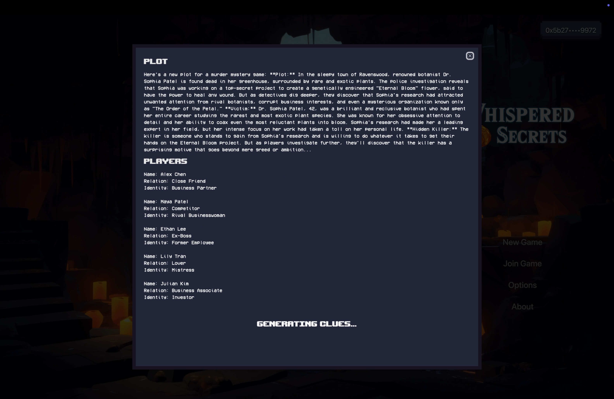
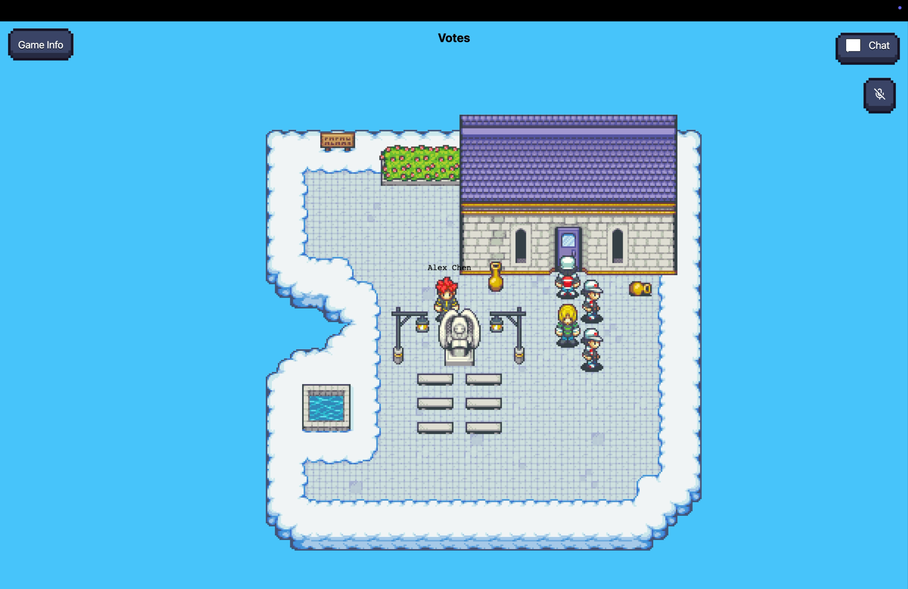
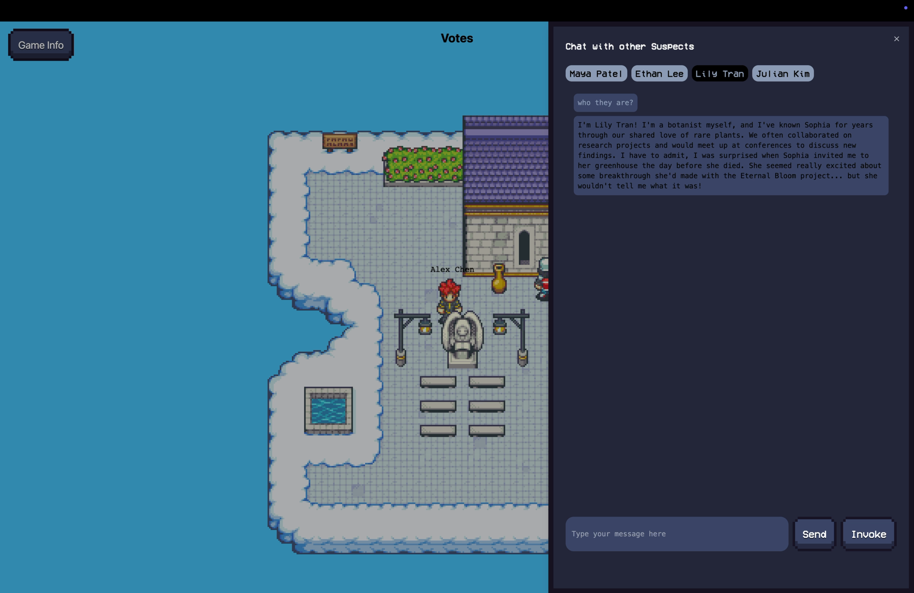
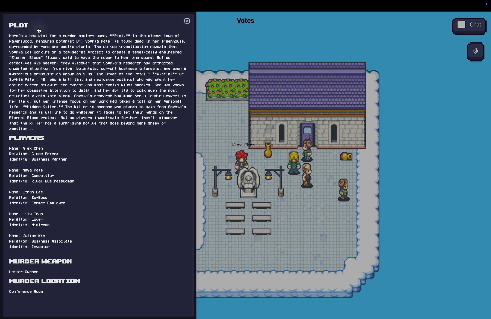

# Whispered Secrets

"Whispered Secrets" is a collaborative murder mystery game where human players and AI agents work together to solve a crime. The game integrates Coinbase's Agent Kit, allowing AI agents powered by LLMs to perform on-chain operations like staking and reward distribution. Players uncover clues, interact with AI-driven characters, and strategize to identify the killer. The project showcases the seamless integration of AI and blockchain in a dynamic, interactive experience.

## Screenshots 📸

<table>
  <tr>
    <td valign="top" width="50%">
      <br>
      
    </td>
    <td valign="top" width="50%">
      <br>
      
    </td>
  </tr>
</table>

<table>
  <tr>
    <td valign="top" width="50%">
      <br>
            
    </td>
    <td valign="top" width="50%">
      <br>
            
    </td>
  </tr>
</table>

<table>
  <tr>
    <td valign="top" width="50%">
      <br>
            
    </td>
    <td valign="top" width="50%">

  </tr>
</table>

## 🎥 Demo Video

[](https://www.youtube.com/watch?v=Ejbyz9tX_is)

## 🧑🏼‍💻 Tech Stack

- **Frontend**: Next.js, Tailwind CSS, `@shadcn/ui`, `phasor`
- **Integration**: `wagmi`, `web3modal`

## Get Started 🚀

The following repository is a turborepo and divided into the following:

- **apps/web** - The web application built using NextJS.

First install the dependencies by running the following:

```

pnpm install

```

Then fill in the Environment variables in `apps/www/.env.local`

```bash

```

Then run the following command to start the application:

```bash
pnpm dev
```

---
